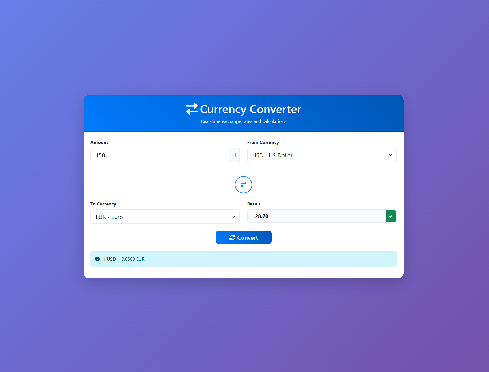
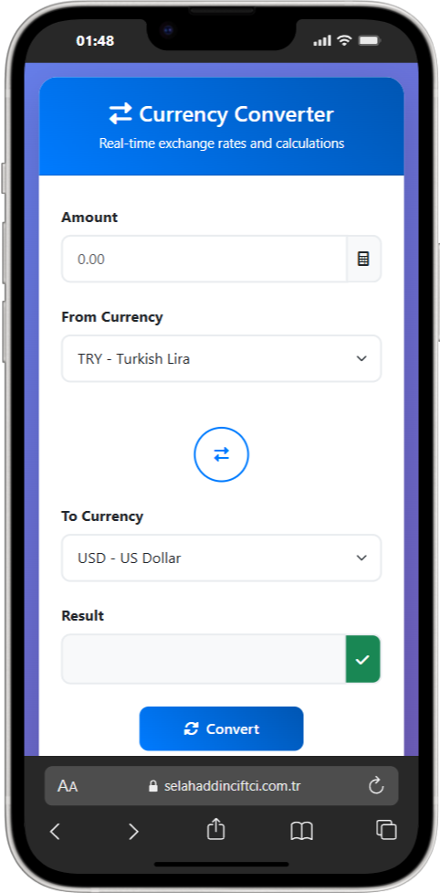

# Currency Converter 💱 | Para Birimi Çevirici | Währungsrechner

## 🌐 Live Demo | Canlı Demo | Live-Demo

**Demo Link:** [https://selahaddinciftci.com.tr/project/currency-converter/](https://selahaddinciftci.com.tr/project/currency-converter/)

## 📸 Screenshots | Ekran Görüntüleri | Screenshots






---

## 🇺🇸 English

### ✨ Features
- **Real-time Exchange Rates** - Live currency data
- **Responsive Design** - Works on all devices
- **Modern UI** - Beautiful gradient design
- **Multiple Currencies** - 8 major currencies
- **Instant Conversion** - Real-time calculation
- **No Registration** - Completely free

### 🛠️ Technologies
- **Frontend:** HTML5, CSS3, JavaScript
- **Backend:** PHP 7.4+
- **Styling:** Bootstrap 5
- **API:** exchangerate-api.com

### 🚀 Installation
1. Clone repository
2. Upload to web server
3. Access via browser

### 💱 Supported Currencies
TRY, USD, EUR, GBP, JPY, CHF, CAD, AUD

---

## 🇹🇷 Türkçe

### ✨ Özellikler
- **Gerçek Zamanlı Kurlar** - Anlık döviz verileri
- **Responsive Tasarım** - Tüm cihazlarda çalışır
- **Modern Arayüz** - Güzel gradient tasarım
- **Çoklu Para Birimi** - 8 ana para birimi
- **Anlık Dönüşüm** - Gerçek zamanlı hesaplama
- **Üyelik Gerektirmez** - Tamamen ücretsiz

### 🛠️ Teknolojiler
- **Frontend:** HTML5, CSS3, JavaScript
- **Backend:** PHP 7.4+
- **Stil:** Bootstrap 5
- **API:** exchangerate-api.com

### 🚀 Kurulum
1. Repository'yi klonla
2. Web sunucusuna yükle
3. Tarayıcıdan eriş

### 💱 Desteklenen Para Birimleri
TRY, USD, EUR, GBP, JPY, CHF, CAD, AUD

---

## 🇩🇪 Deutsch

### ✨ Funktionen
- **Echtzeit-Wechselkurse** - Live-Währungsdaten
- **Responsive Design** - Funktioniert auf allen Geräten
- **Moderne UI** - Schönes Gradient-Design
- **Mehrere Währungen** - 8 Hauptwährungen
- **Sofortige Umrechnung** - Echtzeit-Berechnung
- **Keine Registrierung** - Komplett kostenlos

### 🛠️ Technologien
- **Frontend:** HTML5, CSS3, JavaScript
- **Backend:** PHP 7.4+
- **Styling:** Bootstrap 5
- **API:** exchangerate-api.com

### 🚀 Installation
1. Repository klonen
2. Auf Webserver hochladen
3. Über Browser zugreifen

### 💱 Unterstützte Währungen
TRY, USD, EUR, GBP, JPY, CHF, CAD, AUD

---

## 📁 Project Structure | Proje Yapısı | Projektstruktur

```
Currency_Converter/
├── index.html          # Main HTML | Ana HTML | Haupt-HTML
├── style.css           # Custom CSS | Özel CSS | Benutzerdefiniertes CSS
├── script.js           # JavaScript | JavaScript | JavaScript
├── api.php             # PHP Backend | PHP Backend | PHP-Backend
├── README.md           # Documentation | Dokümantasyon | Dokumentation
└── screenshots/        # Screenshots | Ekran Görüntüleri | Screenshots
```

## 🔧 API Information | API Bilgileri | API-Informationen

**exchangerate-api.com** - Free, no registration required | Ücretsiz, üyelik gerektirmez | Kostenlos, keine Registrierung erforderlich

## 📱 Responsive Design | Responsive Tasarım | Responsives Design

- **Desktop** - Full features | Tam özellikler | Vollständige Funktionen
- **Tablet** - Touch optimized | Dokunmatik optimize | Touch-optimiert
- **Mobile** - Compact design | Kompakt tasarım | Kompaktes Design

## 🎨 Design Features | Tasarım Özellikleri | Design-Features

- **Gradient Backgrounds** - Modern look | Modern görünüm | Modernes Aussehen
- **Smooth Animations** - Enhanced UX | Gelişmiş UX | Verbesserte UX
- **Hover Effects** - Interactive | Etkileşimli | Interaktiv
- **Loading States** - User feedback | Kullanıcı geri bildirimi | Benutzer-Feedback

## 🔄 How It Works | Nasıl Çalışır | Wie es funktioniert

1. **Load Rates** - Fetch data | Veri çek | Daten abrufen
2. **User Input** - Enter amount | Miktar gir | Betrag eingeben
3. **Convert** - Calculate result | Sonucu hesapla | Ergebnis berechnen
4. **Display** - Show result | Sonucu göster | Ergebnis anzeigen

## 🐛 Troubleshooting | Sorun Giderme | Fehlerbehebung

**API Issues | API Sorunları | API-Probleme:**
- Check cURL | cURL'ü kontrol et | cURL prüfen
- Verify connection | Bağlantıyı doğrula | Verbindung prüfen

**Styling Issues | Stil Sorunları | Styling-Probleme:**
- Check Bootstrap | Bootstrap'ı kontrol et | Bootstrap prüfen
- Verify CSS | CSS'i doğrula | CSS prüfen

## 📄 License | Lisans | Lizenz

Open source | Açık kaynak | Open Source

## 👨‍💻 Author | Yazar | Autor

**Selahaddin Çiftçi**
- Website: [selahaddinciftci.com.tr](https://selahaddinciftci.com.tr)
- Demo: [Currency Converter](https://selahaddinciftci.com.tr/project/currency-converter/)

## 🤝 Contributing | Katkıda Bulunma | Beitragen


